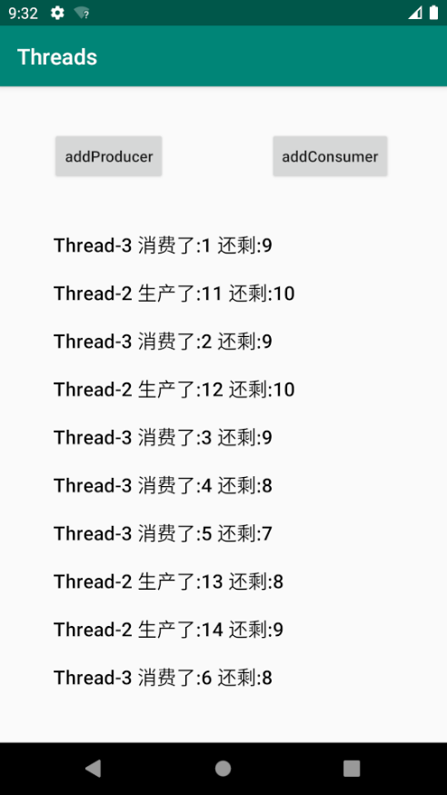

<h1>作业说明</h1>

### 一、作业目标

使用多线程模拟生产者消费者场景。

在此场景中，生产者每隔一段固定的时间生产出n件商品，商店商品的数量具有最大值max。

如果商品的数量等于max，则生产者进行等待直到商品的数量小于max。
如果商品的数量小于max大于max-n，则生产者将商品数量补至max。

消费者每隔一段时间购买一件商品，如果商店商品的数量为0则进行等待，直到商店商品的数量大于0。

生产者和消费者可以有多个。

每件商品具有唯一编号，编号为从1开始的连续数字。

要求不得重复生产相同的编号的产品，不得重复出售相同的编号的产品，不得出售没有被生产的编号的产品。

**只需修改指定文件：**
- MainActivity

**网络学堂需要提交上述指定文件以及界面图。**

### 二、作业要求

实现producer类中的produce函数和consumer类中的consume函数。输出生产和消费信息到textView中。

生产信息格式为：<线程名> + " 生产了:" + <编号> + " 还剩:" + <剩余数量> + "\n";

消费信息格式为：<线程名> + " 消费了:" + <编号> + " 还剩:" + <剩余数量> + "\n";

当第stop个商品被生产后，停止所有子线程。

实验环境与之前相同：
- Android Studio版本： 3.6 
- AVD版本：Pixel 2 API R
- gradle版本：5.6.4

最终效果如图所示：

