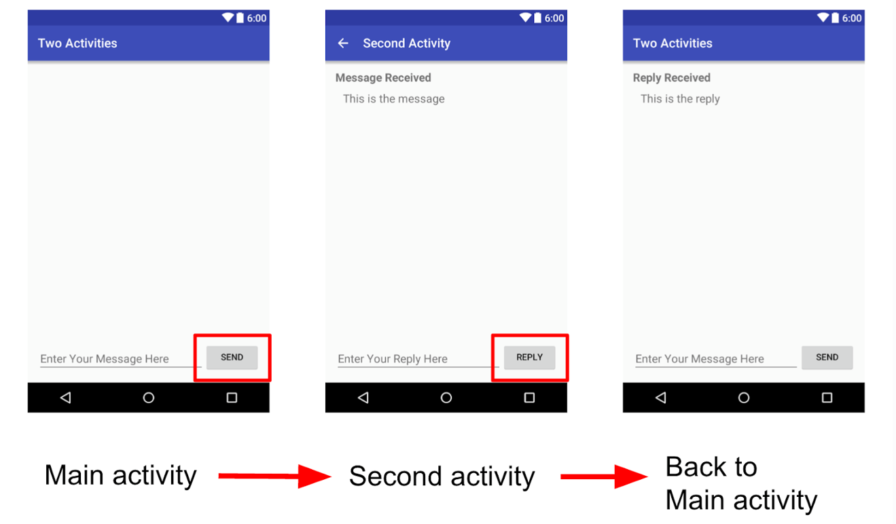

<h1>作业说明</h1>

### 一、代码说明

​本次作业中由助教提供的代码有以下几部分，除TODO部分外，**其他代码都不可以被修改**

#### MainActivity类：

1. onStart()：继承自系统回调函数，在生命周期改变时用来输出Log信息，其他同理。
2. onSaveInstanceState(Bundle outState)：用来在配置更改中保持活动状态，
3. onCreate(Bundle savedInstanceState)：初始化Activity。
4. launchSecondActivity(View view)：处理发送按钮的onClick事件，创建Intent并启动SecondActivity。
5. onActivityResult(int requestCode, int resultCode, Intent data)：处理来自SecondActivity的Intent中返回的数据。

#### SecondActivity类：
1. onCreate(Bundle savedInstanceState)：获取启动此活动的Intent和附加消息。
2. returnReply(View view)：获取EditText的信息，创建Intent并点击回复按钮将消息返回给MainActivity。
### 二、作业要求
创建一个含有两个Activity的应用程序，在第一个Activity的EditText中输入文字，点击发送按钮使用Intent发送消息至第二个Activity中并进行显示，然后在第二个Activity中的EditText中输入文字点击回复按钮将消息发送并显示到到第一个Activity中。

此外还需要对应用程序的数据进行保存和恢复，以保证在配置更改时，例如旋转手机屏幕时不会丢失用户数据。

在程序运行和旋转屏幕时观察Log输出，理解Activity的生命周期运行逻辑。

MainActivity具体要求：
1. onSaveInstanceState中实现保存数据。
2. onCreate中实现恢复数据。
3. launchSecondActivity中实现启动SecondActivity。
4. onActivityResult中实现消息的接收和显示。

SecondActivity具体要求：
1. onCreate中实现Intent的接收和显示。
2. returnReply中实现消息的回复。

**只需提交含TO-DO代码的java文件：
本次作业即MainActivity.java和SecondActivity.java。**

### 三丶实验环境
1. 建议使用最新版Android Studio 3.6，低版本可能无法打开。
2. 助教使用AVD版本 Pixel 2 API R,其余能正常运行版本皆可。
3. 助教使用gradle版本为5.6.4。

最终效果如图所示：
