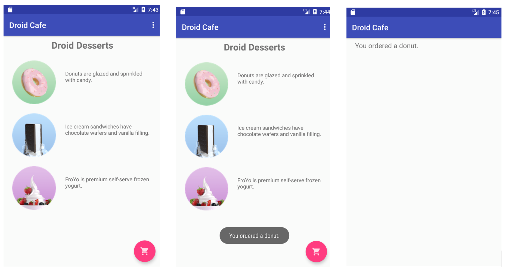

<h1>作业说明</h1>

### 一、代码说明

本次作业需要同学实现可点击图片，修改悬浮按钮（FAB）点击事件，在不同activity间传递数据。

**只需修改指定文件：**

- content_main.xml
- MainActivity
- OrderActivity
    
创建layout的需要的资源可以在drawable，values中找到，如果需要使用这些资源可以直接进行引用。

**网络学堂需要提交上述指定文件以及最终效果图。**

### 二、具体要求

1. 添加可点击图片ice_cream和froyo，并为它们添加点击事件，显示信息并修改mOrderMessage

2. 修改FAB的点击事件，使点击FAB打开OrderActivity并将mOrderMessage传递给OrderActivity

3. 在OrderActivity中显示收到的数据

实验环境与之前相同：
- Android Studio版本： 3.6 
- AVD版本：Pixel 2 API R
- gradle版本：5.6.4

最终效果如图所示：
