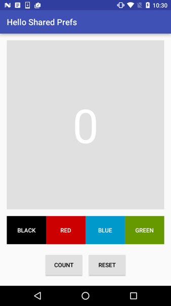

<h1>作业说明</h1>

### 一、代码说明

本次作业已有功能：
1. 点击 COUNT 按钮使数字+1
2. 点击 BLACK、RED、BLUE、GREEN 等按钮改变背景颜色
3. 点击 RESET 按钮将数字和颜色重置为默认值

本次作业需要实现以下功能：
1. 旋转设备，背景颜色和计数都被保留。
2. 退出并重启 APP，背景颜色和计数都被保留。

**只需修改指定文件：**
- MainActivity

**网络学堂需要提交上述指定文件以及界面图。**

### 二、作业要求

可以将设置状态保存到 SharedPreferences 文件中，并在应用程序重新启动时将该数据读入并恢复，使得重启 APP 后设置不会恢复为默认值。

需要在以下几处新增代码：
1. onCreate函数中进行SharedPreferences对于Count和Color的接收和显示。
2. reset函数中进行preferences的清除。
3. onPause函数中进行preferencesEditor的保存。

实验环境与之前相同：
- Android Studio版本： 3.6 
- AVD版本：Pixel 2 API R
- gradle版本：5.6.4

界面如图所示：

