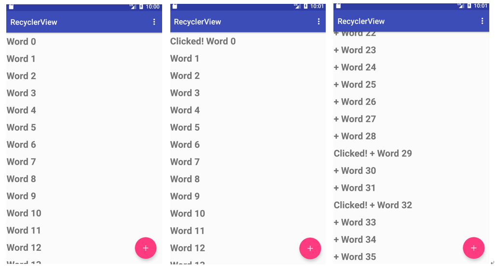

<h1>作业说明</h1>

### 一、代码说明

本次作业需要实现可点击图片，修改悬浮按钮（FAB）点击事件，在不同activity间传递数据。

**只需修改指定文件：**

- MainActivity
- WordListAdapter

**网络学堂需要提交上述指定文件以及最终效果图。**

### 二、具体要求

1. 完善WordListAdapter内容
    - WordViewHolder
    - WordListAdapter

2. 完善MainActivity
    - 绑定Adapter
    - 修改FAB点击事件
	

实验环境与之前相同：
- Android Studio版本： 3.6 
- AVD版本：Pixel 2 API R
- gradle版本：5.6.4

最终效果如图所示：
