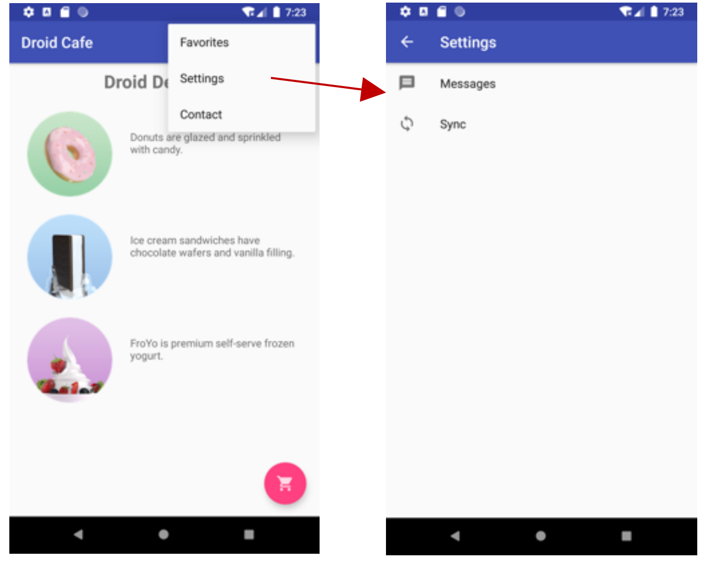
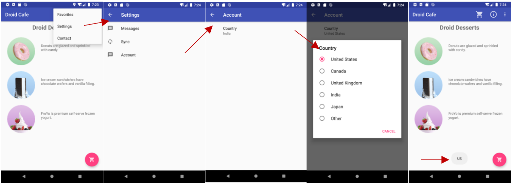

<h1>作业说明</h1>

### 一、代码说明
本次作业流程如下：
1. 运行 APP 后点击主页面右上角的 Settings 按钮进入设置界面。
2. 在 Settings 中添加一个 Account 选项，点击进入 Account 设置界面。
3. 在 Account 中添加一个 Country 选项，点击进行 Country 的设置。
4. 返回主页面后使用后 toast 将设置结果通知给用户。

**只需修改指定文件：**
- MainActivity
- SettingsActivity

**网络学堂需要提交上述指定文件以及界面图。**

<!-- 原始代码运行效果：

 -->

### 二、作业要求

需要在以下几处新增代码：
1. MainActivity的onCreate函数：完善PreferenceManager和SharedPreferences
2. SettingsActivity的onPreferenceStartFragment函数：处理Fragment的新建和替代。
3. SettingsActivity的末尾新增AccountFragment类。

实验环境与之前相同：
- Android Studio版本： 3.6 
- AVD版本：Pixel 2 API R
- gradle版本：5.6.4

最终效果如图所示：

