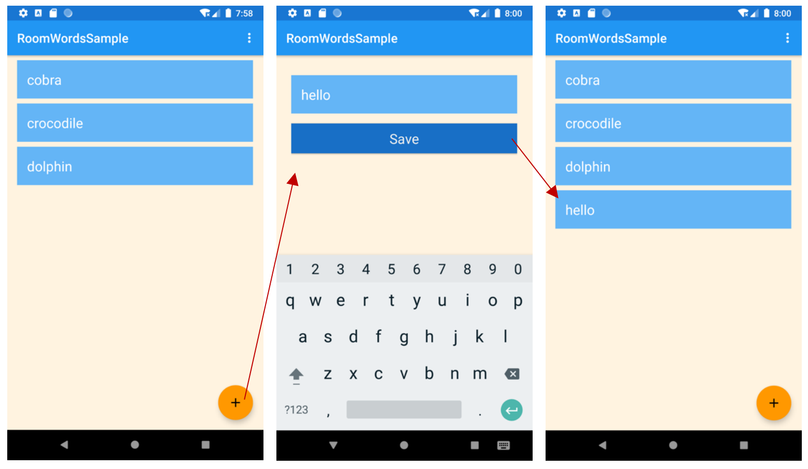
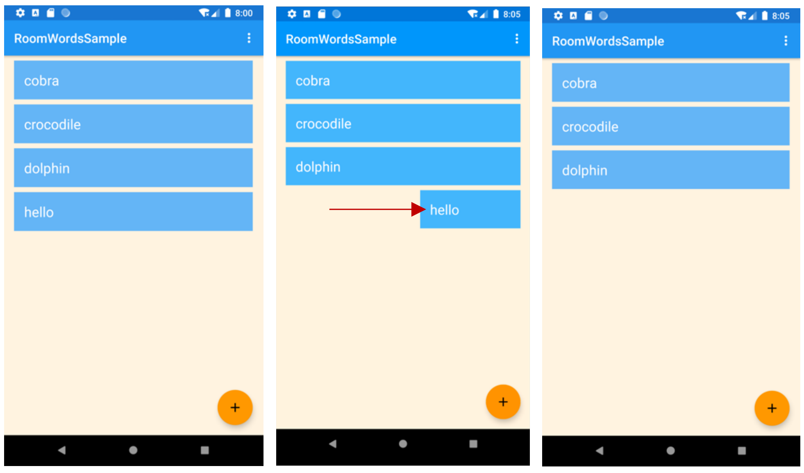
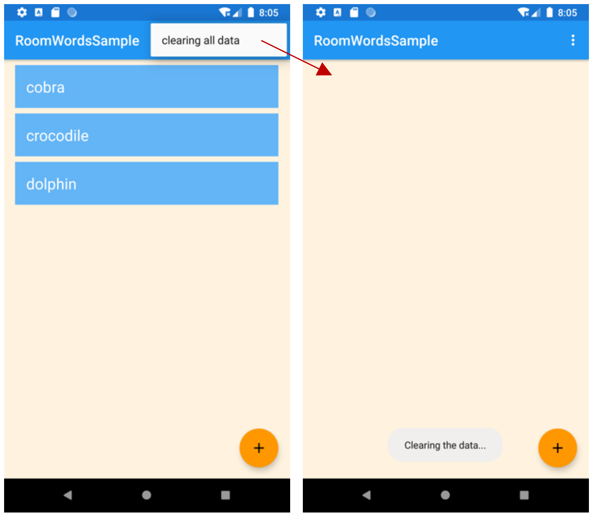

<h1>作业说明</h1>

### 一、代码说明

本次作业需要实现以下功能：
1. Word 类只有一个字段用于存储单词；
2. 主界面显示存储的所有单词；
3. 点击主界面右下角的“+”按钮进入添加单词界面，添加后返回主界面显示新的单词；
4. 滑动主界面的词条能够删除对应的单词
5. 点击主界面右上角的菜单选择 Clearing all data 按钮清空所有存储的单词；

**只需修改指定文件：**
- MainActivity

**网络学堂需要提交上述指定文件以及界面图。**

### 二、作业要求
使用WordViewModel文件中的函数进行代码完善。

需要在以下几处新增代码：
1. onCreate函数中使用WordListAdapter完善recyclerView。
2. onChanged函数中使用adapter设置word。
3. onSwiped函数中使用deleteWord进行word删除。
4. onOptionsItemSelected函数中使用deleteAll进行数据清除。
5. onActivityResult函数中使用insert插入word。

实验环境与之前相同：
- Android Studio版本： 3.6 
- AVD版本：Pixel 2 API R
- gradle版本：5.6.4

界面如图所示：

### 功能一：添加，效果如图所示：

### 功能二：删除，效果如图所示：

### 功能三：删除所有单词，效果如图所示：

有任何疑问请随时联系助教！

